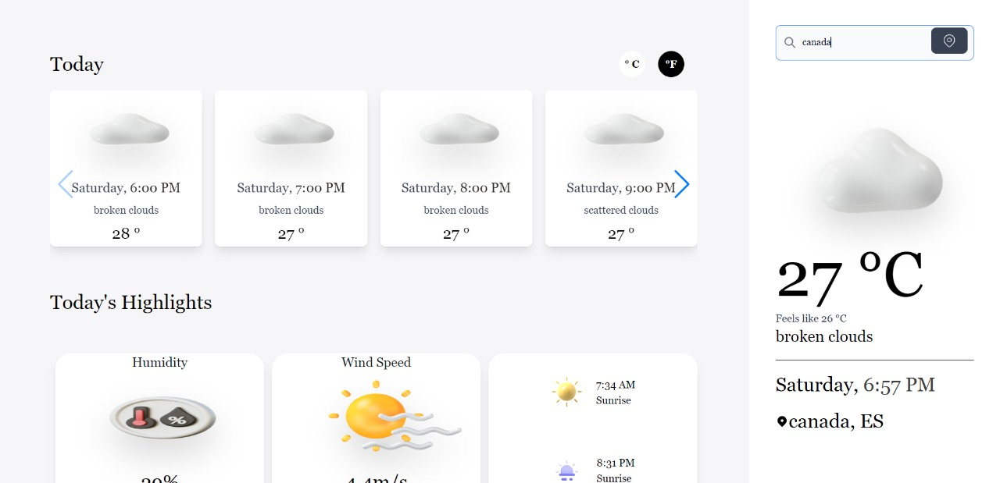
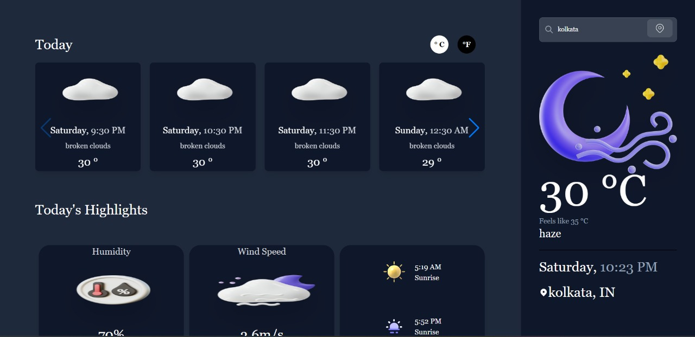

# Weather Ready


<hr>

##  ***weatherReady*** is an app that lets you know the weather forecast up to a week in advance. You can monitor weather with wind speed and other relevant data for you for any location around the globe.


<br />
<br />

# Preview

<h1><a src="https://weatherready.netlify.app/" target="_blank">SITE IS LIVE HERE</a> </h1>



<br />
<br />

<br />
<br />

# Installation Guide


```js
git clone https://github.com/Yourstruggle11/WeatherReady.git
```

```js
cd ./WeatherReady
```
```js
npm i
```
```js
npm start
```

# API Config

## For this application I have used OpenWeatherMap API (It's free)

go to [HERE](https://home.openweathermap.org/api_keys "OpenWeather") to get your API KEY


## Once you have created your API key then follow these steps

- Create `.env` file in the root of the project
- copy `env var` from `.env-copy` and paste it into your `.env` file
- value of `.env var` should be your API key


## ***Your app all set***

<hr />

## ***Feel free to copy anything, it's all yours***


## Thank You, Made with ❤️ by Souvik Sen
